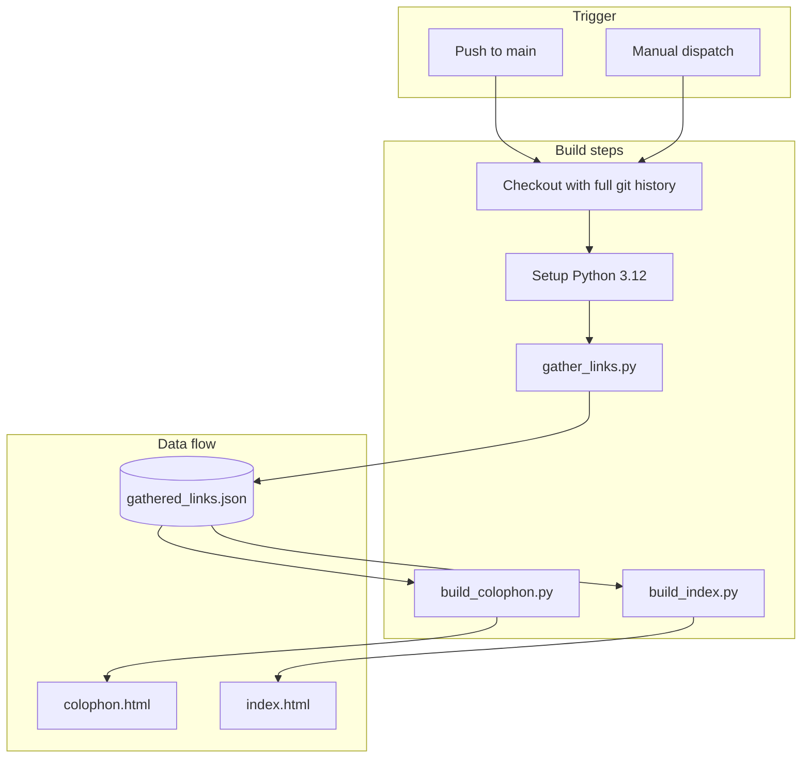

### How the Tool repo on my github works
First off, the tool repo on my github was shamelessly stolen from Simon Willison, who is a prolific software engineer and influential tech blogger. I've been following his blog for a bit now and he is excellent at showcasing and explaining what he does.

His tools\ and research\ repos are great vehicles for experimenting in this golden age of coding and I saw it as a great way to ease my own transition back into coding in this new world.

To that extent, I've created my own tools\ and research\ repos so I could understand how they work. This is an attempt to document it because I ~~forget~~ things!

### Simon's webpages on his tools repo

Basically, this is to help me if I get lost and need to understand how all this works again!

The key pages describing his tools repos are:
1. [Patterns for building tools](https://simonwillison.net/2025/Dec/10/html-tools)
2. [In-depth example of using LLMs for code](https://simonwillison.net/2025/Mar/11/using-llms-for-code/#a-detailed-example)

### Build pipeline: Python scripts and GitHub Actions

The tools repo uses three Python scripts that run in sequence via a GitHub Actions workflow. Here's how they fit together:

**Script summary:**

| Script | Input | Output | Purpose |
|--------|-------|--------|---------|
| `gather_links.py` | `*.html` files + git log | `gathered_links.json` | Scans HTML tools, gets commit history, extracts URLs (e.g. Claude transcript links) from commit messages, extracts title/description from each file |
| `build_colophon.py` | `gathered_links.json` | `colophon.html` | Builds the colophon page with per-tool commit history, linkified URLs, and transcript links |
| `build_index.py` | `gathered_links.json` | `index.html` | Builds the main tools index with cards linking to each tool and its history |

The workflow uploads the built artifacts (including the hand-written HTML tools) and deploys to GitHub Pages.

### Claude Code Transcript Tool

What's missing from the above workflow is what should go into the commit.
Simon has explained that the transcript that was used to birth the tool into existence should also be committed to the repo. Which makes a lot of sense! So how do you get these conversations into the commits? (and once, they're in there, the scripts above will pick them up and add them to the colophon and index pages).

That's what the Claude Code Transcript Tool is for! What's great about this setup is that it allows you to record the prompt that helped create the tool and then use it to understand the thought process that went into creating the tool. You can view the transcript and understand the thinking that went into creating the tool.

Here are the key pages:

1. [Recording the prompt that helped create the tool](https://simonwillison.net/2025/Dec/10/html-tools/#record-the-prompt-and-transcript)
2. [Claude Code Transcript Tool](https://simonwillison.net/2025/Dec/25/claude-code-transcripts/)

Unfortunately at the time of this writing, the Claude Code Transcript Tool is unable to obtain the transcripts from the Claude.ai web interface. This was using a reverse-engineered, undocumented API that is no longer working.

The workaround is to make the conversation public and use the public URL to get the transcript and add it to the commit.

### TO-DOs
Simon has included AI descriptions of the tools in the repo. I need to add these to my own repo.
This is the [page that describes how this is done](https://simonwillison.net/2025/Mar/13/tools-colophon/)